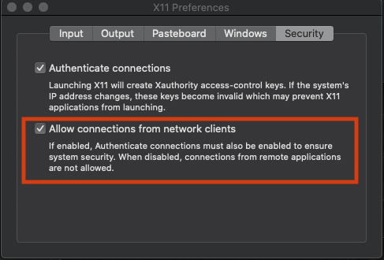

# IntelliJ-IDEA-Docker


## About
IntelliJ IDEA IDE Community Edition IDE in a docker container. Provides a full Java IDE in a docker container with Open JDK.

## Usage
### Windows:
1. [Install Docker/Compose](https://docs.docker.com/compose/install/). You must have Docker and Compose installed to run your Jekyll project in Docker.

2. [Install GWSL](https://opticos.github.io/gwsl/). GWSL handles running XServer on top of WSL. (Graphical Windows Subsystem for Linux)

3. Using GWSL, navigate to the folder you downloaded the project to, build the docker image.

```
docker build -t lumunix/intellij-idea-docker .
```
4. Using GWSL, navigate to the **<Repo Directory>/windows** folder, run docker compose to start Intellij

```
docker-compose up
```


### macOs:
1. [Install Docker/Compose](https://docs.docker.com/compose/install/). You must have Docker and Compose installed to run your Jekyll project in Docker.

2. Install [Homebrew](https://brew.sh) using Terminal
```
ruby -e "$(curl -fsSL https://raw.githubusercontent.com/Homebrew/install/master/install)"
```

3. Using Terminal, install [Socat](https://linux.die.net/man/1/socat) with homebrew

```
brew install socat
```

4. Using Terminal install [xquartz](https://www.xquartz.org) with homebrew
```
brew install xquartz
```

5. Open Xquartz, in the Preferences of the xQuartz app in the Security tab, check **allow connections from network clients**
```
open -a Xquartz
```


6. Using Terminal, navigate to the folder you downloaded the project to, build the docker image.
```
docker build -t lumunix/intellij-idea-docker .
```
7. Run Socat
```
socat TCP-LISTEN:6000,reuseaddr,fork UNIX-CLIENT:\"$DISPLAY\"
```

8. Using Terminal, navigate to the **[Repo Directory]/macOs** folder, run this command, you will get a inet ip address, add the IP address to the **.env** file as follows.
```
ifconfig | grep "inet " | grep -v 127.0.0.1 | cut -d\  -f2
```

```
XSERVEIP=<YOUR IP FROM IFCONFIG>
```

9. Using Terminal, navigate to the **[Repo Directory]/macOs** folder, run docker compose to start Intellij

```
docker-compose up
```
